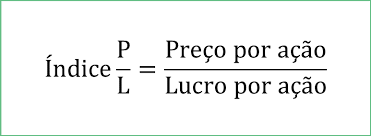

# Glossário de Conceitos 📚

Este arquivo explica os principais conceitos utilizados nas análises deste repositório. Os termos estão organizados em ordem crescente de complexidade, começando pelos mais básicos e avançando para os mais técnicos.

---

## 1. Ação
Uma **ação** é uma fração do capital social de uma empresa. Ao comprar uma ação, você se torna sócio da empresa e tem direito a participar dos lucros (por meio de dividendos) e das decisões (para ações ordinárias).

---

## 2. Preço de Fechamento
O **preço de fechamento** é o valor pelo qual uma ação foi negociada no último pregão do dia. É um dos indicadores mais utilizados para analisar o desempenho de um ativo.

---

## 3. Média Móvel
A **média móvel** é um indicador técnico que suaviza os dados de preço ao calcular a média dos preços de fechamento de um ativo em um período específico. É usada para identificar tendências.

- **Média Móvel Simples (SMA)**: Média aritmética dos preços de fechamento em um período.
- **Média Móvel Exponencial (EMA)**: Dá mais peso aos preços recentes, respondendo mais rapidamente às mudanças.

---

## 4. Tendência
Uma **tendência** é a direção geral em que o preço de um ativo está se movendo. Pode ser:

- **Tendência de Alta**: Quando os preços estão subindo.
- **Tendência de Baixa**: Quando os preços estão caindo.
- **Tendência Lateral**: Quando os preços oscilam sem uma direção clara.

---

## 5. Análise Técnica
A **análise técnica** é uma metodologia que estuda o comportamento dos preços de ativos ao longo do tempo, utilizando gráficos e indicadores para prever movimentos futuros. Alguns dos principais conceitos incluem:

- **Suporte e Resistência**: Níveis de preço onde a tendência tende a parar ou reverter.
- **Indicadores Técnicos**: Ferramentas como Bandas de Bollinger.

---

## 6. Análise Fundamentalista
A **análise fundamentalista** avalia a saúde financeira de uma empresa com base em indicadores econômicos, financeiros e setoriais. Alguns dos principais indicadores incluem:

- **P/L (Preço/Lucro)**: Relação entre o preço da ação e o lucro por ação.
- **ROE (Return on Equity)**: Mede a eficiência da empresa em gerar lucro com o capital investido.
- **Dividend Yield**: Retorno em dividendos em relação ao preço da ação.

---

## 7. P/L (Preço/Lucro)
O **P/L** é um dos indicadores mais utilizados na análise fundamentalista. Ele compara o preço da ação com o lucro por ação (LPA). A fórmula é:

Um P/L baixo pode indicar que a ação está subvalorizada, enquanto um P/L alto pode sugerir que a ação está supervalorizada.

---

## 8. ROE (Return on Equity)
O **ROE** é um indicador financeiro que mede a rentabilidade de uma empresa em relação ao patrimônio líquido. Ele é calculado como:

\[
ROE = \frac{\text{Lucro Líquido}}{\text{Patrimônio Líquido}} \times 100
\]

Um ROE alto indica que a empresa está gerando bons retornos para os acionistas.

---

## 9. Dividend Yield
O **Dividend Yield** é um indicador que mostra o retorno em dividendos em relação ao preço da ação. Ele é calculado como:

\[
\text{Dividend Yield} = \frac{\text{Dividendos por Ação}}{\text{Preço da Ação}} \times 100
\]

Um Dividend Yield alto pode ser atraente para investidores que buscam renda passiva.

---

## 10. EBITDA
O **EBITDA** (Earnings Before Interest, Taxes, Depreciation, and Amortization) é uma medida do lucro operacional da empresa, excluindo despesas financeiras, impostos, depreciação e amortização. Ele é usado para avaliar a eficiência operacional de uma empresa.

---

## 11. Dívida Líquida/EBITDA
Este indicador mede a capacidade da empresa de pagar suas dívidas com o lucro operacional (EBITDA). A fórmula é:

\[
\text{Dívida Líquida/EBITDA} = \frac{\text{Dívida Líquida}}{\text{EBITDA}}
\]

Um valor baixo indica que a empresa tem uma boa capacidade de pagamento.

---

## 12. Brent
O **Brent** é um tipo de petróleo bruto usado como referência global para precificação do petróleo. Ele é extraído do Mar do Norte e é um dos principais benchmarks para o mercado de petróleo. O preço do Brent afeta diretamente empresas do setor de petróleo e gás, como a PETR4.

---

## 13. Correlação
A **correlação** mede a relação entre duas variáveis. No mercado financeiro, é comum analisar a correlação entre ativos, como ações e commodities. Uma correlação próxima de 1 indica que os ativos tendem a se mover juntos, enquanto uma correlação próxima de -1 indica que eles se movem em direções opostas.

---
